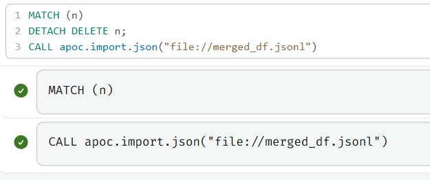

# Table of contents

<!-- TOC start (generated with https://github.com/derlin/bitdowntoc) -->

- [Initial setup](#initial-setup)
  * [Cloning the repository](#cloning-the-repository)
  * [Exploring and understanding the original dataset](#exploring-and-understanding-the-original-dataset)
  * [Transforming the dataset for Neo4j](#transforming-the-dataset-for-neo4j)
    + [Creating the DataFrame](#creating-the-dataframe)
    + [Preparing our JSON file for Neo4j](#preparing-our-json-file-for-neo4j)
      - [Defining our schema](#defining-our-schema)
    + [Converting the JSON file for APOC](#converting-the-json-file-for-apoc)
      - [Case 1: for nodes](#case-1-for-nodes)
      - [Case 2: for relationships](#case-2-for-relationships)
      - [Creating the Nodes](#creating-the-nodes)
      - [Creating the Relationships](#creating-the-relationships)
  * [Creating the Neo4j database and importing the data in it](#creating-the-neo4j-database-and-importing-the-data-in-it)
    + [Creating the Neo4j database](#creating-the-neo4j-database)
      - [Importing into Neo4j](#importing-into-neo4j)
- [Running the queries](#running-the-queries)
  * [Simple queries](#simple-queries)
  * [Hard queries](#hard-queries)
  * [Complex query](#complex-query)
- [Appendices](#appendices)
  * [utils.py](#utils.py)
  * [Neo4j is a pain](#neo4j-is-a-pain)
    + [Confusing error messages](#confusing-error-messages)
    + [No ability to remove existing labels](#no-ability-to-remove-existing-labels)
    + [Inconsistent and unpredictable versionning](#inconsistent-and-unpredictable-versionning)

<!-- TOC end -->

\pagebreak

# Initial setup

## Cloning the repository

We start our journey by simpling cloning our repository, which contains the original version of the dataset we are working on: `earthquakes_big.geojson.jsonl`.

```
git clone https://github.com/matthewslouismarie/neo4j.git
```

## Exploring and understanding the original dataset

As mentioned above, our repository contains our original dataset, named `earthquakes_big.geojson.jsonl`. We renamed the extension to `.jsonl` in a bid to make it explicit that it is written with [the JSON Lines file format](https://jsonlines.org/).

First, as instructed, we will display one row of the original dataset. (We only formatted the first row for readability and trimmed lines that were too long for presentation only, no transformation of any kind was performed on the file itself.)

```json
{
  "type": "Feature",
  "properties": {
    "mag": 0.8,
    "place": "6km W of Cobb, California",
    "time": 1370259968000,
    "updated": 1370260630761,
    "tz": -420,
    "url": "http://earthquake.usgs.gov/earthquakes/eventpage/nc72001620",
    "detail": "http://earthquake.../feed/v1.0/detail/nc72001620.geojson",
    "felt": null,
    "cdi": null,
    "mmi": null,
    "alert": null,
    "status": "AUTOMATIC",
    "tsunami": null,
    "sig": 10,
    "net": "nc",
    "code": "72001620",
    "ids": ",nc72001620,",
    "sources": ",nc,",
    "types": ",general-link,geoserve,nearby-cities,origin,phase-data,scitech-link,",
    "nst": null,
    "dmin": 0.00898315,
    "rms": 0.06,
    "gap": 82.8,
    "magType": "Md",
    "type": "earthquake"
  },
  "geometry": {
    "type": "Point",
    "coordinates": [
      -122.7955,
      38.8232,
      3
    ]
  },
  "id": "nc72001620"
}
```

Let's now explore the meaning of each property. We base our explanations on [the ANSS Comprehensive Earthquake Catalog (ComCat) Documentation](https://earthquake.usgs.gov/data/comcat/index.php), provided by the official source for our original data.

Term | Meaning
---- | -------
`alert` | Either "`green`", "`yellow`" or "`red`". This measures the fatalities and the economic loss caused by the earthquake [according to the PAGER scale](https://earthquake.usgs.gov/data/comcat/index.php#alert).
`cdi` | The maximum reported intensity of the earthquake. An earthquake can be associated with many intensities, as the intensity is only what was recorded by a specific sensor at a specific location, and it varies based on the type of ground and the distance from the earthquake. Read more on the USGS's [Earthquake Magnitude, Energy Release, and Shaking Intensity](https://www.usgs.gov/programs/earthquake-hazards/earthquake-magnitude-energy-release-and-shaking-intensity) page.
`code` | A code assigned by the **source** for the data. It identifies the earthquake among all other earthquakes **provided by the same source**.
`coordinates` | "An earthquake begins to rupture at a **hypocenter** which is defined by a position on the surface of the earth (**epicenter**) and a depth below this point (**focal depth**). We provide the coordinates of the epicenter in units of latitude and longitude."
`detail` | "Link to GeoJSON detail feed from a GeoJSON summary feed."
`dmin` | "Horizontal distance from the epicenter to the nearest station (in degrees). 1 degree is approximately 111.2 kilometers. **In general, the smaller this number, the more reliable is the calculated depth of the earthquake.**"
`felt` | "The total number of felt reports submitted to the DYFI? system." **This is not to be confused with how strongly the earthquake was felt!** (Though there may be a correlation.)
`gap` | "The largest azimuthal gap between azimuthally adjacent stations (in degrees). **In general, the smaller this number, the more reliable is the calculated horizontal position of the earthquake.** Earthquake locations in which the azimuthal gap exceeds 180 degrees typically have large location and depth uncertainties."
`id` | A unique identifier for the event, made of the source network identifier and the network-assigned `code`.
`ids` | **A comma-separated list of event ids that are associated to an event.** This will be easy to represent in Neo4j!
`mag`, `magtype` | The magnitude of the earthquake, which is a measure of how big it is. An earthquake only has one true magnitude of a certain type, although it can have intensities. There are many magnitude types, such as Richter. For a list of magnitude types, read USGS's [Magnitude Types](https://www.usgs.gov/programs/earthquake-hazards/magnitude-types) page.
`mmi` | The maximum estimated instrumental intensity for the event. Computed by [ShakeMap](https://earthquake.usgs.gov/data/shakemap/).
`net` | The ID of a data contributor. Identifies the network considered to be the preferred source of information for this event.
`nst` | The total number of seismic stations used to determine earthquake location."
`place` | "Textual description of named geographic region near to the event."
`rms` | "The root-mean-square (RMS) travel time residual, in sec, using all weights. This parameter provides a measure of the fit of the observed arrival times to the predicted arrival times for this location. Smaller numbers reflect a better fit of the data. The value is dependent on the accuracy of the velocity model used to compute the earthquake location, the quality weights assigned to the arrival time data, and the procedure used to locate the earthquake."
`sig` | "A number describing how significant the event is. Larger numbers indicate a more significant event. This value is determined on a number of factors, including: magnitude, maximum MMI, felt reports, and estimated impact."
`sources` | "A comma-separated list of network contributors."
`status` | Either `AUTOMATIC`, `REVIEWED`, `PUBLISHED`. "Indicates whether the event has been reviewed by a human."
`time` | When did the event occur.
`tsunami` | "This flag is set to "1" for large events in oceanic regions and "0" otherwise. **The existence or value of this flag does not indicate if a tsunami actually did or will exist.**"
`type` | Either `earthquake`, `quarry`. It is not explicitely defined what `quarry` means in this context, but it probably means the event was not an actual earthquake but a **quarry blast**, a controlled explosion designed to create or extend quarries. [You can find examples of quarry blasts on YouTube, it’s fairly impressive.](https://www.youtube.com/watch?v=SBi1NXOnkE4)
`types` | `cap`, `dyfi`, `general-link`, `origin`, `p-wave-travel-times`, `phase-data`. A comma-separated list of product types associated to this event.
`updated` | "Time when the event was most recently updated"
`url` | Link to USGS Event Page for event.

Before we finish, we will also make sure to keep a note of the number of lines of the original dataset.

```bash
root@6d7fb3f3b522:/workspaces/MongoDB# wc -l earthquakes_big.geojson.jsonl 
7668 earthquakes_big.geojson.jsonl
```

There are are 7668 newline characters. In other words, there are 766**9** lines. :)

## Transforming the dataset for Neo4j

In this section, we will load our original dataset into Python, transform it, and save the transformed dataset to a file named `merged_df.jsonl` so that it can be imported by Neo4j and make use of its graph features (such as displaying relationships between different kinds of nodes).

Before anything, we install the Python librairies needed by our code:

```bash
root@b25ec756d684:/workspaces/neo4j# pip install -r requirements.txt
```

### Creating the DataFrame

Next, we load our original dataset `earthquakes_big.geojson.jsonl` into a Pandas DataFrame and transform it into another DataFrame called `merged_df`, the same we used since the Cassandra assignment. For this, we will use `prepare_dataset` function defined in `utils.py`. This is the same preparation code than we used in the Cassandra assignment, with a few improvements. (Which are documented in the file `utils.py`.) **The code that was used is included in the appendices of this report (at the very end of this document).**

```python
merged_df = utils.prepare_dataset(utils.DATASET_PATH)
```

The resulting `merged_df` dataset has the correct types applied. Unneeded (*i.e.* static) columns are removed. Timestamps are converted to the right format and are made timezone-independent millisecond timestamps. Nested properties are flattened, etc. Duplicates values for magnitude were unified (*e.g.* `mb_Lg` and `MbLg` stand for the same thing).

### Preparing our JSON file for Neo4j

Now, we will need to convert our JSON to a JSON format Neo4j can understand and import data from. But first, we need to define what kind of nodes and relationships we want to have.

#### Defining our schema

From this description of the properties that we gave in [Exploring and understanding the original dataset](#exploring-and-understanding-the-original-dataset), we can infer several types of *Nodes* and *Relationships* for our future graph database:

 - **Earthquake** (obviously)
 - **Source Network**: Represent a network of recording stations that provided the information for a particular earthquake.
 - **Recorded by**: Represent the relationship between an earthquake and its primary source.
 - **Also recorded by**: Represent the relationship between an earthquake and its secondary sources.

We come up with the following ERD diagram:


### Converting the JSON file for APOC

APOC is the Neo4j plugin that is able to import data from a JSON file.

In the Python file, each line must either be a Node or a Relationship, as this is the format prescribed by the APOC importer.

APOC expects a **JSON Lines format file**, which simply means a file where each line contains a valid JSON value. In the case of APOC, it expects each line to be an object of either of the following formats:

#### Case 1: for nodes

```json
{
  "id": "An ID unique among all nodes",
  "type": "node",
  "label": ["ALabelForTheNode"], // e.g. "Earthquake",
  "property": {
    // The node's properties...
  }
}
```

#### Case 2: for relationships

```json
{
  "id": "An ID unique among all relationships",
  "type": "relationship",
  "label": "A_LABEL_FOR_THE_RELATIONSHIP", // e.g. "RECORDED_BY",
  "property": {
    // The node's properties...
  },
  
  "start": {
    "id": "Some node ID"
  },
  "end": {
    "id": "Some node ID"
  }
}
```

#### Creating the Nodes

We first convert coordinates to a format Neo4j can understand

```python
merged_df['coordinates'] = merged_df['coordinates']
  .apply(lambda x: {'latitude': x[1], 'longitude': x[0], 'height': x[2]})
```

The name of the node, as it appears in Neo4j, is its first property. For this reason, we add a description for each earthquake as the very first column:

```python
merged_df.insert(
    loc=0,
    column='description',
    value="Mag " + merged_df['mag'].astype(str) + " in " + merged_df['place'],
)
```

We then convert each earthquake to the correct format as described previously:

```python
earthquakes_df = pd.DataFrame(
    {
        'id': merged_df['id'],
        'type': 'node',
        'properties': merged_df.to_dict(orient='records'),
    },
)

earthquakes_df['labels'] = earthquakes_df.apply(lambda x: ['Earthquake'], axis=1)
```

We do the same for the source networks:

```python
neo4j_networks = pd.DataFrame(
    {
        'type': 'node',
        'labels' : 'Network',
        'id': merged_df['net'].unique(),
    }
)

neo4j_networks['labels'] = neo4j_networks['labels'].apply(lambda x: [x])
```

#### Creating the Relationships

Now that the Nodes are created, we can create the Relationships.

```python
relationships_df = pd.DataFrame({
    'type': 'relationship',
    'label': 'RECORDED_BY',
    'start': merged_df['id'],
    'end': merged_df['net'],
})
```

We now create the `LINKED_TO` relationships. This creates a relationship between from any earthquake with an associated ID (in the `ids` property) different from its own, and the designated earthquake.

```python
for index, row in merged_df[merged_df.apply(lambda x: len(x['ids']) > 1, axis=1)].iterrows():
    for id in row['ids']:
        # We verify the id is not the earthquake's own ID
        if id != row['id']:
            # We create the relationship and add it to `relationships_df`
            relationships_df = pd.concat([
                relationships_df,
                pd.DataFrame({
                    'type': 'relationship',
                    'label': 'LINKED_TO',
                    'start': row['id'],
                    'end': id,
                }, index=range(1))
            ], ignore_index=True)
```

Now, we do the `ALSO_RECORDED_BY` relationship (for additional source networks).

```python
for index, row in merged_df[merged_df.apply(lambda x: len(x['sources']) > 1, axis=1)].iterrows():
    for id in row['sources']:
        # We verify the id is not the earthquake's own ID
        if id != row['net']:
            # We create the relationship and add it to `relationships_df`
            relationships_df = pd.concat([
                relationships_df,
                pd.DataFrame({
                    'type': 'relationship',
                    'label': 'ALSO_RECORDED_BY',
                    'start': row['id'],
                    'end': id,
                }, index=range(1))
            ], ignore_index=True)
```

Finally, we do some final processing to have the correct format as described previously:

```python
# Finally, we apply the correct format for APOC, which requires `start` and
# `end` to be structured like nodes, and we also add an `id` property.
relationships_df['start'] = relationships_df['start'].apply(lambda x: {'id': x})
relationships_df['end'] = relationships_df['end'].apply(lambda x: {'id': x})
relationships_df['id'] = relationships_df.index
```

## Creating the Neo4j database and importing the data in it

In this section, we will create a Neo4j server, a DBMS, and a database, and we will import our transformed dataset into it.

### Creating the Neo4j database

First, we need to create a Neo4j server. We will use Docker, and more precisely Docker Compose for that.

To automate the process, we chose to create a `compose.yml` file, as it makes it possible to define once and for all the ports to publish, the volumes to create and the environment variables to set.

```yaml
services:
  neo4j_dsn:
    image: neo4j:latest # We use the latest community (free) version of Neo4j
    ports:
      - 7474:7474 # We open this port for the server HTTP web interface
      - 7687:7687 # We open this port as it is used by Neo4j internally
    volumes:
      - ./data:/var/lib/neo4j/import # The dataset needs to be in this folder to be imported
    environment:
      - NEO4J_apoc_export_file_enabled=true
      - NEO4J_apoc_import_file_enabled=true
      - NEO4J_apoc_import_file_use__neo4j__config=true
      - NEO4J_PLUGINS=["apoc", "graph-data-science"] # We need these plugins for import and analysis
      - NEO4J_dbms_security_procedures_unrestricted=apoc.*,gds.*
      - NEO4J_AUTH=none # No password needed, we are only doing tests in dev
```

Creating our server is as simple as running `docker-compose up` **from the folder containing the `compose.yml` file**!

#### Importing into Neo4j

Now that our server is running (see previous step), we can now import our data into Neo4j.

We first need to create constraints on the unicity of node IDs.

```
CREATE CONSTRAINT IF NOT EXISTS FOR (n:Earthquake) REQUIRE n.neo4jImportId IS UNIQUE;
CREATE CONSTRAINT IF NOT EXISTS FOR (n:Network) REQUIRE n.neo4jImportId IS UNIQUE;
CALL apoc.import.json("file://merged_df.jsonl");
```

**Note that these constraints automatically create indexes, making some our future queries run faster (well, when it is based on the ID at least).**

The queries execute normally.



The process of calling `apoc.import.json` takes a very long time, which is normal because our file is now very large (and it is read from a Docker volume, which doesn't help). For this reason, we will not add additional relationships to our data, such as Country, which would take too much time to import and run queries on.

We can also very we have the correct number of earthquakes:


We also notice our nodes are properly named with a descriptive name!


We can now apply additional transformations on our data to make our queries simpler. Let’s create a `coordinates` field typed with Neo4j’s native 3D `Point` type!

```
MATCH (e:Earthquake)
SET e.loc = point({
  latitude: e.`coordinates.latitude`,
  longitude: e.`coordinates.longitude`,
  height: e.`coordinates.height`
});
```

Neo4j returns "Set 7669 properties"!

\pagebreak

# Running the queries

Now that our server is set up, and that our database is created and filled with the data, we can run queries on the data!

## Simple queries

### 1. Understanding the scale of the `sig` (significance) property

As was described in [Exploring and understanding the original dataset](#exploring-and-understanding-the-original-dataset), `sig` is a number that represents how significant the earthquake was by compining multiple factors. We recall: "This value is determined on a number of factors, including: magnitude, maximum MMI, felt reports, and estimated impact." In other words, it combines the damages caused by the earthquakes as well as how big it was and how strongly it was felt.

As such, it may very well be the intuitive metrics to describe an earthquake.

First, we need to get an idea of the scale of this number, so we will simply compute some statistics on this property.

```cypher
MATCH (e:Earthquake)
RETURN MIN(e.sig), AVG(e.sig), MAX(e.sig), stDevP(e.sig);
```

The result:

```json
[
  {
    "MIN(e.sig)": 0,
    "AVG(e.sig)": 62.95905593949685,
    "MAX(e.sig)": 1110,
    "stDevP(e.sig)": 97.82148428802358
  }
]
```

So, the significance of an earthquake is a positive number, with 0 being the lowest value. Values can be very different, as indicated by the 
average value being 62 and the maximum value being 1110. However, most values are concentrated roughly around $62$ (at least, when compared with the maximum value of $1110$), as indicated by the standard deviation of $98$.

### 2. What does a `sig` (significance) of $0$ mean?

We notice some earthquakes have a significance of $0$ in the previous query. This may sound strange, as an earthquake necessarily has a magnitude, which should give it a significance, even if very low.

For this reason, we want to check whether a significance of $0$ mean the earthquake is not significant at all, or whether the significance was not computed for this earthquake.

To do that, we will list the earthquakes with a significance of $0$, and see whether they are all of trivial significance or not.

Let's now try to see what their intensity and impact are:

```
MATCH (e:Earthquake)
WHERE e.sig = 0
RETURN COUNT(e), AVG(e.mag), MAX(e.mag);
```

```json
[
  {
    "COUNT(e)": 143,
    "AVG(e.mag)": 0.06647887323943662,
    "MAX(e.mag)": 0.18
  }
]
```

We obtain 143 earthquakes, with a very low average magnitude ($\approx 0.07$), and a maximum magnitude of $0.18$. This is extremely low, regardless of the magnitude type.

We conclude that a significance of $0$ is indeed representative of the earthquake, and means it was a very low importance.

### 3. Getting related earthquakes

An earthquake can be related to another one, as indicated by the `ids` property (see [Exploring and understanding the original dataset](#exploring-and-understanding-the-original-dataset)). Let’s find earthquakes that are linked to others!

```
MATCH (e1:Earthquake)-[l:LINKED_TO]->(e2:Earthquake)
RETURN e1, l, e2;
```


We find only one relationship between two earthquakes. This is because many earthquakes are related to others that are not included in our original dataset! (Our dataset is just a subset of a much bigger dataset.)

### 4. Getting a visualisation of the networks

Networks are networks of recording stations that collectively provided all of our data about earthquakes.

It would be nice to know how many there are, who they are, and how many earthquakes they recorded.

```
MATCH p=()-[:RECORDED_BY]->() RETURN p;
```


This gives us a nice visualisation of the number of networks and the number of earthquakes for which they are the primary source. There are 13 networks that are the primary source for at least one earthquake. Some networks are the primary source for many, many earthquakes, while others are the primary source for very few earthquakes.

### 5. Statistics about the networks

Okay. For performance reasons, we can make the query a bit simpler and get only the number of networks and the number of earthquakes for which they are the primary source.

```
MATCH (n:Network)
OPTIONAL MATCH (:Earthquake)-[recorded_by:RECORDED_BY]->(n)
OPTIONAL MATCH (:Earthquake)-[also_recorded_by:ALSO_RECORDED_BY]->(n)
RETURN n.neo4jImportId, count(recorded_by) AS n_primary_earthquakes, count(also_recorded_by) AS n_secondary_earthquakes
ORDER BY n_primary_earthquakes DESC, n_secondary_earthquakes DESC;
```

For presentation purposes, we present the result as a table:

`n.neo4jImportId` | `n_primary_earthquakes` | `n_secondary_earthquakes`
----------------- | ----------------------- | -------------------------
`us` | 103824 | 103824
`ak` | 51818 | 51818
`ci` | 13068 | 13068
`nc` | 12852 | 12852
`nn` | 8091 | 8091
`mb` | 477 | 477
`uw` | 432 | 432
`uu` | 288 | 0
`pr` | 219 | 0
`hv` | 109 | 0
`nm` | 80 | 0
`se` | 7 | 0
`ld` | 4 | 4

### 6. Statistics about quarry blasts

Quarry blasts are controlled explosions designed to create craters and extend quarries. [You can find examples on YouTube.](https://www.youtube.com/watch?v=SBi1NXOnkE4)

We expect quarry blasts to have a much lesser magnitude and depth that earthquakes, so let's compare the two (simply indicating `e.type` suffices to group aggregates by this value).

```
MATCH (e:Earthquake)
RETURN e.type, COUNT(e), AVG(e.mag), MAX(e.mag), MAX(e.felt), AVG(e.`coordinates.height`)
```

`e.type` | `COUNT(e)` | `AVG(e.mag)` | `MAX(e.mag)` | `MAX(e.felt)` | ```AVG(e.`coordinates.height`)```
-------- | ---------- | ------------ | ------------ | ------------- | ---------------------------------
`earthquake` | $7539$ | $1.6278962727152113$ | $8.3$ | $9163.0$ | $23.26542552062612$
`quarry` | $129$ | $1.4604651162790696$ | $2.5$ | $2.0$ | $0.20155038759689925$
`null` | $1$ | `null` | `null` | `null` | $0.0$

So apparently, those quarry blasts can have quite a significant magnitude! So significant that for one of them, two people actually reported the earthquake.

As a bonus, let’s learn more about this earthquake.

```
MATCH (e:Earthquake)
WHERE e.type = 'quarry' AND e.felt = 2
RETURN e;
```

Property | Value
-- | -------
`<id>` | 4:f78c7a6e-6ab3-45d8-85f4-82059e2df715:10833
dmin | 0.00898315
code | "71995021"
sources | ["nc"]
description | "Mag 1.7000000000000002 in 11km E of Quarry near Portola Valley, CA"
type | "quarry"
sig | 45
tsunami | false
mag | 1.7
gap | 43.2
rms | 0.31
id | "nc71995021"
place | "11km E of Quarry near Portola Valley, CA"
net | "nc"
types | ["cap", "dyfi", "general-link", "geoserve", "nearby-cities", "origin", "phase-data", "scitech-link"]
magtype | "md"
felt | 2.0
coordinates | [-122.1073, 37.3358, 0.0]
cdi | 2.0
url | "http://earthquake.usgs.gov/earthquakes/eventpage/nc71995021"
neo4jImportId | "nc71995021"
ids | ["nc71995021"]
time | 1369084281100
detail | "http://earthquake.usgs.gov/earthquakes/feed/v1.0/detail/nc71995021.geojson"
updated | 1369168393549
status | "REVIEWED"

If we look on Google Maps, we can see the location of the quarry blast.


The given location seems to be a about one kilometer away from its real location, as the quarry seems to be south of the given location. But still, this is precise enough!

## Hard queries

### 1. WHY are some earthquakes related?

Okay, we've retried two earthquakes that are related in one of our simple queries ([3. Getting related earthquakes](#3-getting-related-earthquakes)). However, we’re not sure what that means. Does that mean they share a similar cause? Magnitude? Location? Let's find out!

They are both reviewed earthquakes, provided by the `ci` network, that happened close to "Meiners Oaks, California" (4 and 8km, respectively). They share a similar `cdi` (maximum reported intensity) of $3.7$ and $3.5$.

However, their ML magnitude differ significantly: One is at $3.6$, the other is at $1.4$.

So, their relation seems to come from their location. Let’s measure exactly how close they are, as well as how far apart they happened in time.

```
MATCH (e1:Earthquake)-[l:LINKED_TO]->(e2:Earthquake)
RETURN point.distance(e2.loc, e1.loc), (e2.time-e1.time)/1000;
```
```json
[
  {
    "point.distance(e2.loc, e1.loc)": 4332.587352497241,
    "(e2.time-e1.time)/1000": 9
  }
]
```


They are indeed quite close, only 4km apart! (The distance is returned in meters.) And they happened only 9 seconds apart!

We can even confirm how close they epicenters are on Google maps:


So, an earthquake seems to be related to another when it happened close in time and in location.

### 2. Creating a relationship based on distance

We first need to create a relationship. We will create a relationship between earthquakes that happened close to one another. However, creating a relationship **between all nodes** based on their distance involves going through $7669 \times 7669 = 58,813,561$ records!

For this reason, we will restrict ourselves to only specific networks with not too many primary earthquakes.

Let’s see what networks have the least earthquakes.

```
MATCH (n:Network)<-[r:RECORDED_BY]-(:Earthquake)
RETURN n, count(r) AS n_earthquakes ORDER BY n_earthquakes DESC;
```

`n` | `n_earthquakes`
--- | ----------
`nc` | $2142$
`ak` | $1993$
`ci` | $1452$
`us` | $721$
`uu` | $288$
`nn` | $279$
`pr` | $219$
`uw` | $216$
`mb` | $159$
`hv` | $109$
`nm` | $80$
`se` | $7$
`ld` | $4$

We will restrict ourselves to earthquakes primarily sourced by the "`uu`" network, as it has a few earthquakes registered, but not too many. For other networks, the number would be so large our computer wouldn’t be able to handle it.

We can now create relationships!

```
MATCH (e1:Earthquake{net: "uu"})
MATCH (e2:Earthquake{net: "uu"})
WHERE e1.id < e2.id
  AND e1.loc IS NOT NULL
  AND e2.loc IS NOT NULL
  AND point.distance(e1.loc, e2.loc) < 5000
CREATE (e1)-[r:NEAR {distance: point.distance(e1.loc, e2.loc)}]->(e2)
RETURN e2;
```

This creates 4082 relationships, with a `distance` property.

Let’s view a graph of this:

```
MATCH (e1)-[n:NEAR]->(e2)
RETURN e1, n, e2;
```


## Complex query

In this query, we want to group similar earthquakes using one of GDS (Graph Data Science) functions.

GDS is a plugin for Neo4j, and it usually needs to be installed separately. In our case, as we are using Docker (a great tool), we only had to add `"graph-data-science"` to the `NEO4J_PLUGINS` environment variable, and add `gds.*` to `NEO4J_dbms_security_procedures_unrestricted`.

We first need to create a graph in memory. This will make the actual query run faster, and also prevent any modification to the actual data stored in the database.

```
MATCH (e:Earthquake)
RETURN gds.graph.project(
  'earthquakes_graph',
  e,
  null,
  {
    sourceNodeProperties: { coordinates: [e.`coordinates.longitude`, e.`coordinates.latitude`] },
    targetNodeProperties: {}
  }
)
```

This creates a graph that only takes into account the coordinates of each earthquake.

We can then run the K-means algorithm, which will identify the specified number of *communities* in our data.

```
CALL gds.kmeans.stream('cities', {
  nodeProperty: 'coordinates',
  k: 3,
  randomSeed: 42
})
YIELD nodeId, communityId
RETURN gds.util.asNode(nodeId).description, communityId
ORDER BY communityId ASC
```

The output being very long, I will only display a fraction of it:

### Community 0

This community seems to contain medium earthquakes that happened in non-contiguous US states.

```json
{
  "gds.util.asNode(nodeId).description": "Mag 1.2 in 97km WSW of Cantwell, Alaska",
  "communityId": 0
},
{
  "gds.util.asNode(nodeId).description": "Mag 0.8 in 34km WSW of North Nenana, Alaska",
  "communityId": 0
},
{
  "gds.util.asNode(nodeId).description": "Mag 1.4 in 14km NE of Fritz Creek, Alaska",
  "communityId": 0
},
{
  "gds.util.asNode(nodeId).description": "Mag 2.2 in 11km WSW of Captain Cook, Hawaii",
  "communityId": 0
},
{
  "gds.util.asNode(nodeId).description": "Mag 0.9 in 63km ENE of Talkeetna, Alaska",
  "communityId": 0
},
```

### Community 1

This community seems to gather powerful earthquakes that happened around the world.

```json
  {
    "gds.util.asNode(nodeId).description": "Mag 4.7 in 155km WSW of Panguna, Papua New Guinea",
    "communityId": 1
  },
  {
    "gds.util.asNode(nodeId).description": "Mag 4.5 in 117km NW of Naha-shi, Japan",
    "communityId": 1
  },
  {
    "gds.util.asNode(nodeId).description": "Mag 4.9 in 251km E of Kuril'sk, Russia",
    "communityId": 1
  },
  {
    "gds.util.asNode(nodeId).description": "Mag 4.6 in 3km E of Carmen, Philippines",
    "communityId": 1
  },
  {
    "gds.util.asNode(nodeId).description": "Mag 5.6 in 10km NNW of Linao, Philippines",
    "communityId": 1
  },
  {
    "gds.util.asNode(nodeId).description": "Mag 5.0 in 130km W of Panguna, Papua New Guinea",
    "communityId": 1
  },
  {
    "gds.util.asNode(nodeId).description": "Mag 4.8 in 107km SE of Petropavlovsk-Kamchatskiy, Russia",
    "communityId": 1
  },
  {
    "gds.util.asNode(nodeId).description": "Mag 4.1 in 46km E of Farkhar, Afghanistan",
    "communityId": 1
  },
  {
    "gds.util.asNode(nodeId).description": "Mag 5.1 in 62km NW of Finschhafen, Papua New Guinea",
    "communityId": 1
  },
  {
    "gds.util.asNode(nodeId).description": "Mag 6.2 in 22km SSE of Buli, Taiwan",
    "communityId": 1
  },
  {
    "gds.util.asNode(nodeId).description": "Mag 4.2 in 286km NNW of Al `Aquriyah, Libya",
    "communityId": 1
  },
  {
    "gds.util.asNode(nodeId).description": "Mag 4.9 in 12km NE of Carmen, Philippines",
    "communityId": 1
  },
  {
    "gds.util.asNode(nodeId).description": "Mag 4.9 in 105km WSW of Panguna, Papua New Guinea",
    "communityId": 1
  },
```

### Community 2

This seems to correspond to unimpressive earthquakes that happened in California.

```json
{
  "gds.util.asNode(nodeId).description": "Mag 0.8 in 6km W of Cobb, California",
  "communityId": 2
},
{
  "gds.util.asNode(nodeId).description": "Mag 1.4 in 8km NW of Cobb, California",
  "communityId": 2
},
{
  "gds.util.asNode(nodeId).description": "Mag 1.2 in 6km NW of The Geysers, California",
  "communityId": 2
},
{
  "gds.util.asNode(nodeId).description": "Mag 0.6000000000000001 in 6km NW of The Geysers, California",
  "communityId": 2
},
{
  "gds.util.asNode(nodeId).description": "Mag 1.0 in 17km W of Niland, California",
  "communityId": 2
},
{
  "gds.util.asNode(nodeId).description": "Mag 1.1 in 6km ENE of Desert Hot Springs, California",
  "communityId": 2
},
{
  "gds.util.asNode(nodeId).description": "Mag 0.4 in 7km WNW of Cobb, California",
  "communityId": 2
},
{
  "gds.util.asNode(nodeId).description": "Mag 1.1 in 6km NW of The Geysers, California",
  "communityId": 2
},
{
  "gds.util.asNode(nodeId).description": "Mag 1.2 in 12km WNW of Niland, California",
  "communityId": 2
},
```

### Conclusion

The K-means proved surprisingly adequate and able to categorise our data into meaningful communities, helping us get a better grasp of it in the process!

\pagebreak

# Appendices

## utils.py

This is the code that was used to prepare the original `earthquakes_big.geojson.jsonl` dataset. It is very similar to the code we used in the Cassandra assignment, except it is more efficient and performs additional transformations.

What it does is:

 - It loads the original dataset into a Python object (more precisely, a Pandas DataFrame object);
 - It removes columns that do not bring any information (*i.e.* static columns);
 - It applies the correct types.
 - It transforms timezone-dependent timestamps into proper timestamps;
 - It formats values correctly and applies the corresponding types.

```python
"""Utility module for preparing the original JSON earthquakes dataset.

This module was taken from the previous Cassandra report and provides functions
to prepare the `earthquakes_big.geojson.jsonl` dataset in several ways.
"""

import pandas as pd
import numpy as np

def prepare_dataset(df_path) -> pd.DataFrame:
    """Prepare the original dataset file named 'merged_df'.
    
    This method performs several improvements on the original JSON earthquakes
    dataset, such as applying the correct types, removing unneeded (*i.e.*
    static) columns, fixing the timestamps incorrectly encoded, etc."""

    df = pd.read_json(df_path, lines=True)

    df.drop('type', axis=1, inplace=True) # Contains one unique value

    df_properties = pd.json_normalize(df['properties'])

    # Format types, sources and ids using correct array notation
    df_properties['types'] = df_properties['types'].apply(lambda x: x[1:-1].split(','))
    df_properties['sources'] = df_properties['sources'].apply(lambda x: x[1:-1].split(','))
    df_properties['ids'] = df_properties['ids'].apply(lambda x: x[1:-1].split(','))

    # Convert TZ-aware timestamps
    df_properties['time'] = df_properties.apply(lambda t: pd.Timestamp(
      t['time'], unit='ms', tz=t['tz']) if not np.isnan(t['time']) else None,
      axis=1
    )
    df_properties['updated'] = df_properties.apply(lambda t: pd.Timestamp(
      t['updated'], unit='ms', tz=t['tz']) if not np.isnan(t['updated']) else None,
      axis=1
    )
    df_properties.drop('tz', axis=1, inplace=True)

    # There are some duplicate values in `magType` column but formatted differently.
    # So let's remove the duplicate values from the `magType` column.
    df_properties['magType'] = df_properties['magType'].str.lower().str.replace('_', '')

    # If it caused a tsunami (convert to Boolean correct format)
    df_properties['tsunami'] = df_properties['tsunami'] == 1

    df_geometry = pd.json_normalize(df['geometry'])
    df_geometry.drop('type', axis=1, inplace=True) # Contains one unique value

    # Concatenate properties and geometry
    merged_df = pd.concat(
      [
        df.drop(['properties', 'geometry'], axis=1),
        df_properties,
        df_geometry
      ],
      axis=1
    )

    merged_df.rename(str.lower, axis='columns', inplace=True)

    str_columns = [
      'alert',
      'code',
      'detail',
      'id',
      'magtype',
      'place',
      'net',
      'url',
      'status',
      'type'
    ]
    merged_df[str_columns] = merged_df[str_columns].astype(pd.StringDtype())

    return merged_df

DATASET_PATH = 'earthquakes_big.geojson.jsonl'
```

## Neo4j is a pain

Neo4j and its AOC plugin will give undecipherable Java errors for seemingly no reasons. For instance:

### Confusing error messages

> **Neo.ClientError.Procedure.ProcedureCallFailed**
> Failed to invoke procedure `apoc.import.json`: Caused by: com.fasterxml.jackson.core.io.JsonEOFException: Unexpected end-of-input: expected close marker for Object (start marker at [Source: REDACTED (`StreamReadFeature.INCLUDE_SOURCE_IN_LOCATION` disabled); line: 1, column: 1]) at [Source: REDACTED (`StreamReadFeature.INCLUDE_SOURCE_IN_LOCATION` disabled); line: 1, column: 2]

This is caused because the input file is a JSON file, and not a JSON Lines file.

### No ability to remove existing labels

[Once a label is created, it is almost impossible to delete it.](https://stackoverflow.com/a/21995745/7089212)

This doesn’t work:

```json
{
    "id": "nc72001620",
    "type": "node",
    "properties": {
        "coordinates": {
            "latitude": 38.8232,
            "longitude": -122.7955,
            "height": 3
        }
    },
    "labels": [
        "Earthquake"
    ]
}
```

We get:

> **Neo.ClientError.Procedure.ProcedureCallFailed**
> Failed to invoke procedure `apoc.import.json`: Caused by: java.lang.NullPointerException: Cannot invoke "String.toLowerCase(java.util.Locale)" because "name" is null

### Inconsistent and unpredictable versionning

`apoc.version()` can either return a version following a date.version format, or a semver version.